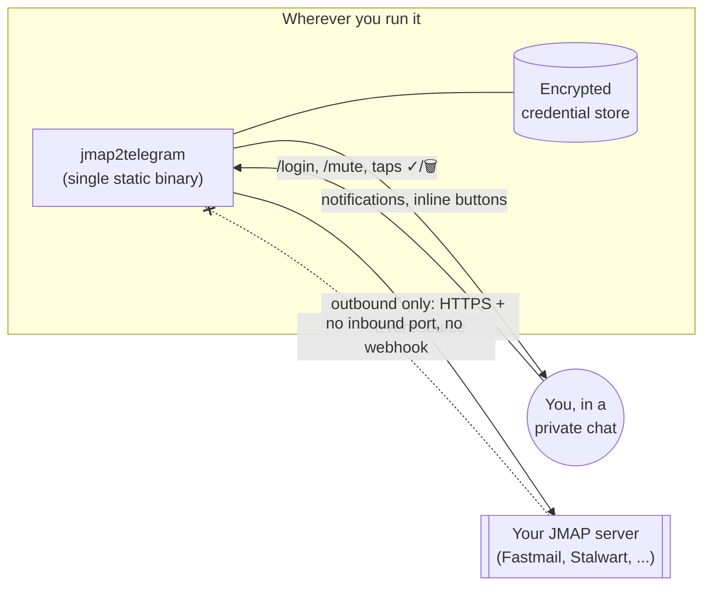

# jmap2telegram

[](https://github.com/delta-whiplash/jmap2telegram/actions/workflows/ci.yml)
[](https://github.com/delta-whiplash/jmap2telegram/actions/workflows/security-audit.yml)
[](https://github.com/delta-whiplash/jmap2telegram/releases/latest)
[](LICENSE)
[](https://github.com/delta-whiplash/jmap2telegram/pkgs/container/jmap2telegram)
[](https://github.com/delta-whiplash/jmap2telegram/pkgs/container/charts%2Fjmap2telegram)

A self-hosted Telegram bot that turns a [JMAP](https://jmap.io/) mailbox
(Fastmail, Stalwart Mail Server, and any other JMAP-compliant provider)
into Telegram notifications — read, mark read, archive, and delete your
mail without leaving the chat.

This is the JMAP equivalent of Telegram's own GmailBot: instead of Google
OAuth, you connect your mailbox by sending your provider's server URL and
an API (Bearer) token directly to the bot in a private message. Because
JMAP providers authenticate with a bearer token rather than a redirect
flow, the bot needs no public callback URL, no webhook, and no inbound
network exposure at all — it only makes outbound connections to Telegram
and to your JMAP server.



## Contents

- [Why JMAP instead of Gmail](#why-jmap-instead-of-gmail)
- [Security & privacy by design](#security--privacy-by-design)
- [Quickstart (Docker)](#quickstart-docker)
- [Commands](#commands)
- [Shared mailboxes](#shared-mailboxes)
- [Extra personal accounts](#extra-personal-accounts)
- [Environment variables](#environment-variables)
- [Kubernetes (Helm, OCI)](#kubernetes-helm-oci)
- [Building from source](#building-from-source)
- [Releases](#releases)
- [Limitations (v1 scope)](#limitations-v1-scope)

## Why JMAP instead of Gmail

- **No OAuth app to register.** A bearer token from your provider's
  security settings is all you need.
- **Push, not polling.** JMAP's `EventSource` mechanism notifies the bot
  the moment new mail arrives (RFC 8620 §7.3).
- **Provider-agnostic.** Works with any JMAP server that supports RFC 8620
  autodiscovery (`/.well-known/jmap`) — Fastmail, Stalwart, and others.
- **Respects Telegram's rate limits.** Every outbound Telegram request goes
  through `teloxide`'s throttle adaptor at Telegram's own documented
  defaults (1 msg/s per chat, 30 msg/s overall) with automatic retry on
  `RetryAfter`, so a burst of new mail (a mailing list flood, a newsletter)
  can't get individual notifications dropped or delayed out of order.
- **Tells you when a connection actually breaks.** A revoked token or an
  unreachable server doesn't just fail silently in a log somewhere: after
  about a minute of being unable to reconnect, the bot sends a message
  telling you which account and why, and another once it's back.

## Security & privacy by design

- **Two environment variables, full stop.** `TELEGRAM_BOT_TOKEN` and
  `AUTHORIZED_CHAT_IDS` are the only configuration the deployment needs.
  Everything else (your JMAP server + token) is entered live, per user,
  through the bot's chat — never through config files or CI secrets.
  (`DATA_DIR`, `ALLOW_PRIVATE_JMAP_HOSTS`, `TIMEZONE`, and `LOG_LEVEL` are
  optional overrides for advanced setups — see below.)
- **SSRF-safe by default.** `/login`'s `server_url` is only ever used if
  it resolves to a public address; private/loopback/link-local/metadata
  addresses are refused unless you explicitly opt in with
  `ALLOW_PRIVATE_JMAP_HOSTS=1`. This matters because `AUTHORIZED_CHAT_IDS`
  can list several mutually-untrusted users on one deployment.
- **Private chats only.** The bot ignores anything that isn't a 1:1 DM, so
  a group chat id in `AUTHORIZED_CHAT_IDS` can't silently hand every
  member of that group control over one shared mailbox.
- **Hard allowlist.** Only the Telegram chat ids listed in
  `AUTHORIZED_CHAT_IDS` can interact with the bot at all; everyone else is
  refused before anything is read, stored, or logged.
- **Encrypted at rest.** Credentials are stored AES-256-GCM encrypted,
  with a random master key generated on first boot and kept at 0600 on
  disk. No email content is ever written to disk — full message bodies
  are fetched on demand and only held in memory long enough to relay them
  to Telegram.
- **The `/login` message self-destructs.** The message carrying your JMAP
  token is deleted from the chat immediately after the bot reads it.
- **Right to erasure.** `/logout` permanently and immediately wipes that
  chat's stored credentials and stops all notifications — no soft delete,
  no retention window.
- **No third-party data flows.** The bot talks to exactly two services:
  the Telegram Bot API and your own JMAP server, both over TLS
  (`rustls`, no OpenSSL in the dependency tree).
- **Minimal attack surface.** No inbound ports, no webhook server, no
  database — a single static binary long-polling Telegram outbound.

See [`SECURITY.md`](SECURITY.md) for the full threat model and how to
report a vulnerability.

## Quickstart (Docker)

```bash
docker run -d \
  --name jmap2telegram \
  -e TELEGRAM_BOT_TOKEN="123456:ABC-your-bot-token" \
  -e AUTHORIZED_CHAT_IDS="111111111,222222222" \
  -v jmap2telegram-data:/data \
  ghcr.io/delta-whiplash/jmap2telegram:latest
```

Or with Compose:

```bash
cp .env.example .env   # fill in TELEGRAM_BOT_TOKEN and AUTHORIZED_CHAT_IDS
docker compose up -d
```

Then, in Telegram, from one of the authorized chats:

```
/start
/login <server_url> <token>
```

- `server_url` is your provider's JMAP server root (e.g. Fastmail:
  `https://jmap.fastmail.com`) — the bot discovers the actual session
  endpoint itself via `/.well-known/jmap`.
- `token` is an API (Bearer) token from your provider's security
  settings — not your account password.

The `/login` message is deleted automatically right after the bot reads
it, so the token doesn't linger in the chat history.

### Commands

| Command        | Effect                                                                 |
|----------------|--------------------------------------------------------------------------|
| `/start`       | Onboarding, or current status if already connected                     |
| `/login`       | `/login <server_url> <token>` — connect a JMAP account                 |
| `/status`      | Show the connected account and watcher health                          |
| `/partages`    | Toggle notifications for shared/delegated JMAP accounts                |
| `/comptes`     | `/comptes <server_url> <token>` — connect an extra, independent JMAP account; no argument lists connected accounts |
| `/mute`        | `/mute <term>` — filter future notifications by sender/keyword; no argument lists active filters |
| `/unmute`      | Remove a filter added with `/mute`                                     |
| `/rechercher`  | `/rechercher <text>` — full-text search of the connected mailbox        |
| `/logout`      | Erase stored credentials immediately (GDPR right to erasure)           |
| `/help`        | List commands                                                          |

The command list is also registered with Telegram itself, so it
autocompletes from the client's own "/" menu.

Each new-mail notification comes with inline buttons: **Lire tout** (full
body), **Lu** (mark read, shown in place afterward as a checkmark),
**Archiver**, **Spam**, **Supprimer** (moves to Trash, not a permanent
delete). The sender is a tappable `mailto:` link, the preview renders as
a native quoted block, and any attachment is named with its size. Every
triage action (Archiver/Spam/Supprimer) leaves a 30-second **↩️ Annuler**
button that restores the message to exactly the mailboxes it was in
before — an in-memory, non-persisted safety net for an accidental tap,
not a second trash bin.

### Shared mailboxes

Some JMAP servers (Stalwart in particular) can grant a token delegated
access to other mailboxes — team/shared inboxes distinct from your own
personal account. `/partages` lists whatever shared accounts your token
currently has access to (fetched live from the server each time, not
cached) with a toggle button per account. Enabling one starts its own
background watcher and notifications for it, labeled with the shared
mailbox's address so you can tell them apart from your own mail; disabling
one stops its watcher and forgets its sync cursor. This is unrelated to
Telegram group chats — the bot still only ever talks in 1:1 DMs (see
[`SECURITY.md`](SECURITY.md)) — it's purely about how many JMAP accounts a
single connected chat follows.

### Extra personal accounts

Unlike `/partages` (delegated access under one token), `/comptes` connects
a second, fully independent JMAP account — its own server and token,
e.g. a work mailbox alongside a personal one. `/comptes <server_url>
<token>` connects one (the message is deleted right after, same as
`/login`); `/comptes` with no argument lists everything connected, with a
disconnect button per extra account. Disconnecting one only forgets that
account — reconnecting means running `/comptes` again with its
credentials.

### Environment variables

| Variable                  | Required | Default | Effect                                                                 |
|----------------------------|----------|---------|-------------------------------------------------------------------------|
| `TELEGRAM_BOT_TOKEN`       | yes      | —       | Bearer token from @BotFather                                           |
| `AUTHORIZED_CHAT_IDS`      | yes      | —       | Comma-separated allowlist of Telegram chat ids                        |
| `DATA_DIR`                 | no       | `/data` | Where the encrypted credential store lives                            |
| `ALLOW_PRIVATE_JMAP_HOSTS` | no       | `0`     | Set to `1` to allow `/login` to a private/internal JMAP server (SSRF guard bypass) |
| `TIMEZONE`                 | no       | `UTC`   | IANA zone name (e.g. `Europe/Paris`) for notification and log timestamps |
| `LOG_LEVEL`                | no       | `info`  | `trace`, `debug`, `info`, `warn`, or `error`                           |
| `RUST_LOG`                 | no       | —       | Advanced per-module filter (tracing's `EnvFilter` syntax); overrides `LOG_LEVEL` when set |

## Kubernetes (Helm, OCI)

```bash
helm install jmap2telegram oci://ghcr.io/delta-whiplash/charts/jmap2telegram \
  --version <chart-version> \
  --set telegram.botToken="123456:ABC-your-bot-token" \
  --set telegram.authorizedChatIds="111111111,222222222"
```

For a real deployment, keep the bot token out of your values files with a
pre-existing Secret instead:

```bash
kubectl create secret generic jmap2telegram-token \
  --from-literal=bot-token="123456:ABC-your-bot-token"

helm install jmap2telegram oci://ghcr.io/delta-whiplash/charts/jmap2telegram \
  --version <chart-version> \
  --set telegram.existingSecret=jmap2telegram-token \
  --set telegram.authorizedChatIds="111111111,222222222"
```

See [`charts/jmap2telegram/values.yaml`](charts/jmap2telegram/values.yaml)
for every option (persistence, resources, security context, ...). The
chart intentionally creates no Service/Ingress — the bot only makes
outbound connections — and always runs exactly one replica, since it's a
single stateful long-poller backed by one local encrypted file store.

## Building from source

```bash
cargo build --release
cargo test
```

Requires no system TLS library (rustls throughout). `cargo test` includes
a mock-server integration test of the JMAP session bootstrap in addition
to unit tests for the config, encrypted store, and message formatting.

## Releases

Tagging `vX.Y.Z` and pushing it triggers
[`.github/workflows/release.yml`](.github/workflows/release.yml), which:

1. re-runs the full CI suite (fmt, clippy, tests, `cargo audit`, Docker
   build, Helm lint);
2. builds and pushes a multi-arch (`amd64`/`arm64`) Docker image to
   `ghcr.io/delta-whiplash/jmap2telegram`, tagged `X.Y.Z`, `X.Y`, `X`, and
   `latest`;
3. packages and pushes the Helm chart as an OCI artifact to
   `oci://ghcr.io/delta-whiplash/charts/jmap2telegram`, versioned from the
   same tag;
4. cuts a GitHub Release with autogenerated notes.

### Staying current with no one at the wheel

The repo is meant to look after itself between feature work:

- **Dependency updates.** [Dependabot](.github/dependabot.yml) opens
  weekly PRs for Cargo, Docker base image, and GitHub Actions updates,
  grouped and gated by the same CI suite as any other PR.
- **Auto-merge for routine bumps.**
  [`dependabot-auto-merge.yml`](.github/workflows/dependabot-auto-merge.yml)
  approves and merges patch/minor Dependabot PRs itself once CI is green;
  major bumps are always left for manual review.
- **Standing security watch.**
  [`security-audit.yml`](.github/workflows/security-audit.yml) re-runs
  `cargo audit` every week regardless of whether anything was pushed, so
  a RUSTSEC advisory published against an already-shipped dependency
  still surfaces as a tracking issue instead of going unnoticed until the
  next unrelated change.

In steady state, that means most future updates are exactly two kinds:
routine version bumps (merged automatically) and the occasional security
fix (flagged automatically, fixed by hand when it needs more than a
`cargo update`).

## Limitations (v1 scope)

- Notifications and reading/triage only — no compose/reply/forward from
  Telegram yet (mirrors GmailBot's core loop, not its full feature set).
- One JMAP account per authorized Telegram chat (multi-tenant); there's no
  shared-mailbox-to-many-viewers mode.
